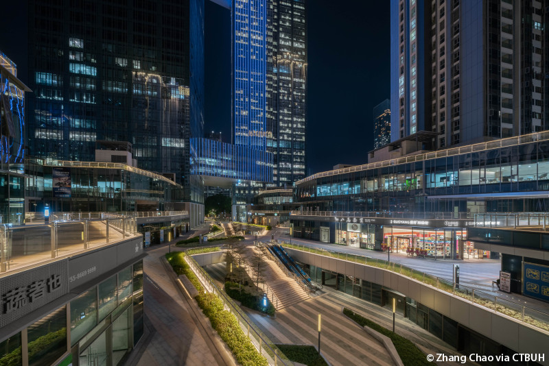

<!--
Allowed values:

type: district, plan

tags: Environment, Mobility, Buildings, Energy, InformationSystems, HealthEducation, InnovationSystems, CivicTech, CivicInnovation, Food

-->

## Overview

<!-- About 100 to 150 word summary of the case study. -->

The Shenzhen Bay Innovation and Technology Centre (SBITC), located in Shenzhen’s Nanshan High-Tech Park, is a large-scale, mixed-use development and a national model for future urban innovation hubs. Completed in 2020, it covers more than 429,090 sq ft of land and provides over 4,100,029 sq ft of gross floor area. The center combines multiple functions, including commercial use (R&D (Research and Development) office spaces, retail space) and residential use (serviced apartments). 

The centre includes five main towers: two dedicated to R&D offices (reaching heights of 1,049ft and 809ft) and three for serviced apartments (ranging from 347ft to 492ft tall). It also features a 4-level mall, supporting a vibrant retail space. The building’s façade design features smart thermal performance, using tinted and fritted glass to optimize natural lighting and reduce energy loss. Overall, the centre is both a functional tech hub and an architectural reflection of Shenzhen’s innovation journey. 

## Goals and Aspirations

<!-- What is the project trying to achieve? Identify 3-5 high-level goals that define the entire project.Replace the placeholder title with a succinct name for the goal. -->

**Foster Innovation and High-Tech Industry Growth**.  A goal of the centre is to serve as a hub for research, development, and innovation, supporting Shenzhen’s ambition to be a global leader in technology. By providing office space and facilities within Shenzhen’s High-Tech Park,  a prominent high-tech zone within the city, the development attracts companies like Huawei, Tencent, and DJI, while also supporting startups and emerging industries.

**Model Environmentally Sustainable Urban Design**.  The centre aims at having an energy-efficient design. It focuses on natural lighting strategies to reduce heat gain and optimize internal climate. This also aligns with broader green building and smart city goals, making the centre a prototype for sustainable urban tech infrastructure.

**Promote Integrated, Mixed-Use Urban Living**. This mixed-use development combines R&D offices, serviced apartments, retail, and public amenities. By combining these facilities, the project aims to create a vibrant, self-contained innovation ecosystem. This encourages live–work–play dynamics that reduce commuting, increase economic growth, and foster collaboration between residents, entrepreneurs, and researchers. 

## Key Characteristics

<!--  How is the project organized into specific activities that advance these goals? For plans: How does the plan address each of the three activities in digital master plans (development, engagement, implementation). For districts: How does the district employ 3-5 of the key characteristics of innovation hubs?
-->

**Spatial Integration of Innovation Functions**.  The Shenzhen Bay Innovation and Technology Centre exemplifies a compact, high-density urban model, where research, residential, and commercial areas are layered within a walkable district. The mixed-use towers are arranged to support vertical zoning. This enables seamless transitions between living, working, and collaborative spaces. This functional integration fosters both economic and spatial efficiency.

**Sustainability and Climate-Responsive Design**.  Environmental performance is a significant factor in the architectural design of the district. The skyscrapers in the district use a gradient façade strategy. Dark tinted glass are used on upper levels for thermal insulation and lighter glass are used below for natural daylight. This design not only enhances energy efficiency, but also gives the complex a coherent visual identity. The project serves as a national example of environmentally conscious urban design by minimizing reliance on mechanical systems and emphasizing passive design strategies at the district scale.

**Transit-Oriented Development (TOD) Potential**.  Located within Shenzhen’s Nanshan High-Tech Zone, the district is strategically positioned near major transit arteries. This enables many modes of transit access to the broader city and Greater Bay Area. Though designed as a self-sufficient district, its proximity to metro lines, highways, and regional transport hubs supports high-capacity movement of talent, goods, and knowledge, reinforcing its role in the regional innovation economy. This aligns with urban design principles of accessibility, permeability, and sustainable mobility.

## Stakeholders
<!--  Who initiated the project? Who is leading the project forward? Who else has a say in how it unfolds? Who is directly affected but marginalized? Identify 3-5 key stakeholder organizations or groups. Identify 3-5 key individuals. These are people who are associated with the project as leaders, supporters, critics, or regulators. They are likely to be members of the stakeholder groups identified above. These are people you should try to contact for one or more interviews.-->

**Shenzhen Investment Holdings Co.**.  Shenzhen Investment Holdings (SIHC) is a state-owned enterprise responsible for overseeing strategic urban developments in Shenzhen. It is the lead developer and financial backer of the Shenzhen Bay Innovation and Technology Centre. SIHC plays a central role in aligning the project with national and city goals for innovation, economic growth, and urban modernization. The company ensures that the project integrates with broader regional plans such as the Greater Bay Area innovation corridor. [SIHC](www.sihc.com.cn)

**Tenants and Tech Companies**.  The district is home to some of China’s largest tech companies. These firms lease the office spaces in the buildings, and often play a collaborative role in shaping the ecosystem of the district. They attract talent from across China and globally, feeding into Shenzhen’s rapidly growing tech workforce. They not only contribute to the economic vitality of the district, but also help transform the district into a tech cluster for creation, collaboration, and experimentation. Moreover, these companies often participate in tech governance, data infrastructure, and smart city development. [Tencent](https://www.tencent.com)  [DJI](https://www.dji.com)  [Huawei](https://www.huawei.com)

**Residents and Residential Management Operators**.  The Center includes three residential towers, rising between 30 to 45 floors, that house serviced apartments. The residents in these apartments are mainly tech professionals, international visitors, and short-term tenants affiliated with nearby corporates. Residents play a key role in shaping the district’s live-work-leisure dynamic, and their experiences contribute directly to the project’s success as a model for urban tech ecosystems. Furthermore, the property management companies are responsible for delivering these high end, comprehensive living environments that support the needs of the innovation driven modern workforce.

## Technology Interventions
<!--  What specific technology-enabled interventions does the project propose? Identify 3-5 technology interventions. Describe use cases, value proposition, solution architecture, data created or consumed, key platforms and standards, business models, regulatory issues, etc. Separate into more than 1 paragraph as needed. This is a good place to insert additional images, be sure to include captions identifying the source and make sure to not use copyrighted images. -->

**Climate-Responsive Façade System**. The towers in the district use a layered, tinted glass façade system that adapts to Shenzhen’s subtropical climate. Dark blue-grey glass is used at the top portion of the buildings to reduce solar heat gain, while lighter blue-grey and white fritted glass are used lower down to maximize natural daylight. This system reduces the need for artificial lighting and HVAC systems, contributing to energy-efficient building performance.

**Smart Building Management Systems (BMS)**.  The buildings in the district are equipped with an integrated BMS that uses IoT-enabled sensors and machine learning algorithms to continuously monitor internal conditions, such as temperature, air quality, and occupancy. The system dynamically adjusts air conditioning, lighting, and ventilation based on real-time feedback. It also facilitates predictive maintenance by detecting anomalies in system performance before the breakdowns actually occur. These systems ensure a resilient and responsive building environment, which is ideal for high-end R&D use.

**Digital Infrastructure for High-Tech R&D**.  The Centre is embedded with fiber optic broadband and 5G infrastructure, providing ultra-low latency connections essential for AI development, IoT testing, and high-throughput computing. Tenants like Tencent and Huawei benefit from cloud-based access to collaborative design tools, big data processing environments, and cross-border development networks. This digital backbone is critical in making the Centre an engine for tech-driven economic development.

## Financing
<!--  How are the technology interventions identified to be financed? How does this fit into financing of the larger project? Identify at least one financing mechanism that is being used. -->

**Financing Scheme**. The financing scheme for the district involves a combination of public investment, private sector participation, and strategic partnerships. Firstly, the district has received substantial backing from the Shenzhen Municipal Government. This support includes funding for infrastructure and incentives to attract high-tech enterprises. Secondly, as a primary developer, Shenzhen Investment Holdings Co., Ltd. has invested significantly in the project, leveraging its resources to develop and manage the Centre. Finally, the district has also attracted large tech firms such as Huawei, Tencent, and DJI, which are using the buildings in the district as office headquarters. These partnerships provide financial contributions through leasing and investments.                

## Outcomes
<!-- What results has the project produced to date? What outcomes and impacts are anticipated? Identify 3-5 (anticipated) outcomes. What will/has the project achieved? Thes should not be the same or repeated from elsewhere. Use this space to emphasize something different. -->
Since its completion in 2020, SBITC has led to several significant outcomes that have contributed to Shenzhen’s development as a global technology hub.

**Establishment of a High-Tech Innovation Hub**.  The Center has become a central hub for research and development, attracting major technology companies and fostering a collaborative environment for innovation. This has enhanced Shenzhen’s reputation as a modern city for technological advancement. It also sets a benchmark for similar technology districts across China.

**Architectural and Environmental Innovation**.  SBITC showcases innovative architectural design, including the use of climate-responsive façades that optimize natural lighting and energy efficiency. These features not only provide aesthetic value but also demonstrate a commitment to environmental sustainability. 

**Integration of Mixed-Use Urban Development**.  The project successfully combines office spaces, residential units, and commercial facilities. This mixed-use approach promotes a vibrant community where professionals can live, work, and engage in leisure activities without needing to commute, contributing to a sustainable urban lifestyle. 

## Open Questions
<!-- What is uncertain, unclear, or still unresolved about this project? Identify 1-3 open question(s). -->

**How will the district maintain affordability and accessibility for a diverse population?**  As SBITC evolves into a high-end innovation hub, the prices of living and rent for the area raises. There’s a risk that the surrounding area becomes inaccessible to smaller businesses, young professionals with lower income , or non-tech residents. How will future policies or developments ensure a socially inclusive urban environment for a diverse population, rather than one dominated by elite tech firms and high-income workers?

**How to manage data privacy and surveillance in a high-tech district?**  With integrated smart systems, such as facial recognition, IoT sensors, and AI-powered building controls, SBITC generates and manages large volumes of personal and behavioral data. It is important that data governance, consent, and transparency are handled appropriately across both public and private spaces.

**How will SBITC adapt to evolving technological trends and maintain its competitive edge?**  LAlthough SBITC is relatively new as it was completed in 2020, technology is going to evolve rapidly in the future. As emerging technologies like AI and quantum computing advance, how will SBITC integrate these innovations into its infrastructure and services in future years? What strategies are in place to ensure that the Centre remains at the forefront of global technological advancements and continues to attract leading tech companies and talent?

## References

---

### Primary Sources

<!-- 3-5 project plans, audits, reports, etc. -->
- [RMJM. “Shenzhen Bay Centre.” ](http://www.sihc.com.cn)
- [Archello. “The Shenzhen Bay Innovation and Technology Centre.” ](https://archello.com/it/project/the-shenzhen-bay-innovation-and-technology-centre)
- [Yantian District Government. “Shenzhen’s Innovation Centers Drive Economic Growth.” ](https://www.yantian.gov.cn/English/news/content/post_9520354.html)
- [Goufang. “深圳湾创新科技中心：南山核心新地标，创新企业首选” ](http://sz.goufang.com/news/29734.html)
- [Baijiahao. “深圳湾科技生态园：低碳绿色与产业创新的融合” ]([http://sz.goufang.com/news/29734.html](https://baijiahao.baidu.com/s?id=1827538338716351027&wfr=spider&for=pc))

### Secondary Sources

<!-- 5-7 secondary source documents: news reports, blog posts, etc.. -->

- [Shenzhen Investment Holdings Co., Ltd.](https://www.tencent.com)
- [Commerce Bureau of Shenzhen Municipality. “Shenzhen National High-Tech Zone.” Shenzhen Government Online](https://www.sz.gov.cn/en_szgov/business/SpecialFunctionalAreas/content/post_11487609.html)
- [KPMG China. “Greater Bay Area Update: Tech and Innovation GBA Newsletter.”](https://assets.kpmg.com/content/dam/kpmg/cn/pdf/en/2021/02/greater-bay-area-update-tech-and-innovation-gba-newsletter.pdf)
- [Tencent](https://www.tencent.com)
- [Huawei](https://www.huawei.com)
- [DJI](https://www.dji.com)

